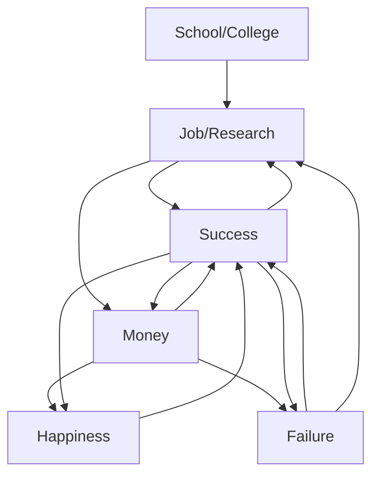
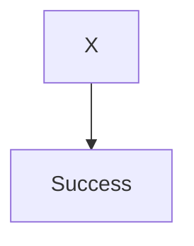
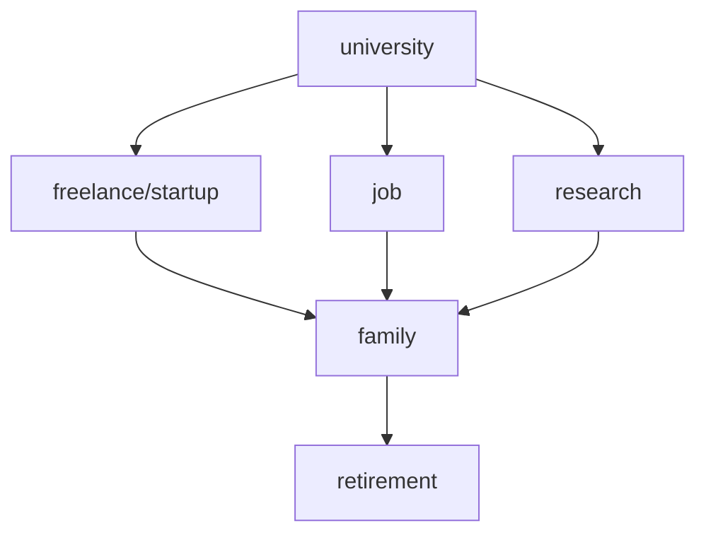

## A collection of information and beyond 101[^1]

> "There is not the slightest indication that nuclear energy will ever be obtainable. It would mean that the atom would have to be shattered at will."[^2] 
\- Albert Einstein, 1932

The understanding of the world is what makes us different, from ideas that seem impossible to the creation of new elements never seen on Earth before. This is the story of something we have been told but never seen. 

### Innovators  

Engineering is nothing without innovation and here's the code for a model to generate a plot showing the number of engineers vs the number of innovations.

https://github.com/m1ten/101/blob/a89d6b6f37b1c668e016d44bd174bd4c0aaeb106/scripts/model.py#L1-L33

When I plugged in the numbers (1000 engineers and 10% rate of innovation), I got the following results:

```
Enter the number of engineers: 1000
Enter the rate of innovation (decimal): 0.1
Innovations:  101
Innovators:  10.100000000000001 %
Innovators (based on distribution curve):  10.0131 %
```


The results are pretty close to what I expected. Of course in the real world, the rate of innovation is not constant but this gives a general idea that not every engineer is an innovator. That fact alone is not a bad thing, there is lot to consider when it comes to innovation and making a model to predict it is not easy. 

#### Why engineering?

After knowing that, why should I become an engineer? I want to be an engineer because I want to learn. If everyone decided that they have no chance of innovating then we would have no innovations at all. We need engineering to even predict what number of innovations we can expect.

To prove my point, here's another plot.


Based on the same rate of `0.1` or `10%`, a single engineer will fail to innovate `90%` of the time. Which is easy enough to calculate but what is often forgotten is there are still `10` successes out of a `100` runs. Those `10` successes are the reason why I am writing this post on a computer and not on a typewriter. Those `10` successes are the reason why we have a lot of things we take for granted. 

As I showed in the first plot, the number of innovations exponentially increases as you add more engineers and even if not all of them are innovators, the number of innovations will still increase. Everyone does not have to be an innovator to make a difference because there are still lot of things to be done. A civil engineer might not be able to invent a new material but they will know how to build a bridge. 

#### What is innovation?

According to AI, it's the following.


Then it goes saying why that definition is, to say the least, "dumb."


I agree with it for the most part. If you can solve a problem, you innovated (or evolved) from a previous state. Every engineer is an innovator because they solve problems which basically means this disproves the rate of innovation model I made. I innovated in 10 minutes, I'm an innovator (or maybe not).

The point is anyone can be an engineer and that involves me; though, I don't think anyone asked. 

### First Game

A few years ago I made a game. This game was probably made in 5 minutes and I remember I wanted to learn the Godot Engine. Here's a picture of the game. 


This is not the most professional thing I have created but I want to keep things authentic. It works, you can try it on [itch.io](https://miten.itch.io/clicker). 

https://github.com/m1ten/101/blob/7a4a6772fe2337666156bea80b523b4cd377f808/scripts/clicker.cs#L1-L108

I am going to be honest. Ever since I created this game, I have not worked on a game project. I worked on other things and currently I am working on a cross platform package manager written in `rust` that utilizes `lua` scripts called [`krait`](https://github.com/m1ten/krait). Based on this, it is not hard to assume that I have minimal interest in game development.

I did work on some pixel art and this is one of those art pieces (very unoriginal).


This is Billy, he was supposed to be a character for testing purposes in my 2D RPG but I never managed to finish the game because I ran out of time. My idea was making a game similar to Rimworld with realistic NPC AI because that would be interesting to play. 

#### What does this have to do innovation?

Nothing and everything. Nothing because I have done nothing special but everything because it is me who has done the something. To put in simple terms, I have innovated by creating something that did not exist before but that does not necessarily have to be something useful or even good.

I wrote a script to figure out the probability of me winning a game of rock-paper-scissors. 

<details><summary>Spoiler Alert</summary>
<p>
I have a 33% chance of winning. You can probably figure out why that is.
</p>
</details>

On paper this seems very useless because anyone with basic math knowledge can probably figure out the probability of winning a game with only three possible outcomes, but that's not fun. That completely ignores the possibility of me being wrong and learning something new. Every engineer has built something similar to this and that is what makes us different from the rest of the world and that is what makes us innovators.

That brings me on to my next point.

https://github.com/m1ten/101/blob/7a4a6772fe2337666156bea80b523b4cd377f808/scripts/rps.py#L1-L41

### How accurate is this data?

The data is very accurate if we discuss basic math but becomes very inaccurate when we include the complex possibilities in the real world. Also the inaccuracy in the `python` functions come into play as the margin of error increases negligibly every iteration. I try to use the Monte Carlo method whenever possible and there is always differences between the theoretical and the real world.

#### Artificial Intelligence[^3]

I really like doing research and questioning things even though most of the time I am not sure what I am doing. Research can also be boring and that's where artificial intelligence comes in, because it's a lot of borrowing and training. I said "borrowing," because the current AI only knows how to steal from independent researchers/developers and doesn't even follow the license as far as the code side of the story is concerned. Most people think that AI is some computer that does human-like things but that's not the case. Neural networks are math functions that are trained to do a specific task, by trained I mean finding patterns in data. 

Self-driving cars are very similar to cars in games driven by NPCs, so think about that next time you sit in a self-driving car. The major difference is in games the data is given but in real life, the data is collected. That is the most important part of machine learning, the data. There has to be minimal chance of error when collecting and using the data because otherwise there is a possibility of a crash.

AI is not magic, it needs data to predict the possibilities and it will copy if there is not enough data to make a decision. 


My point proven. This is where my interest lies at least for now and I want to see AI improve in the future. 

Speaking of AI, here's *Conway's Game of Life* "written" by GitHub's Copilot using OpenAI. Considering the AI has thus far copied from other developers, this game was probably written by someone else to be honest. Probably not fully but the AI did copy individual lines of code from similar projects or modified it to fit the given topic. If the AI did manage to write this game independentally, it's pretty impressive and it innovated.

https://github.com/m1ten/101/blob/7a4a6772fe2337666156bea80b523b4cd377f808/scripts/ai-game.py#L1-L127


I had the AI write *Conway's Game of Life* again but this time in `C` and it gave a different kind of result. The executable for the game is available at [ai-game.exe](bin/ai-game.exe).

https://github.com/m1ten/101/blob/7a4a6772fe2337666156bea80b523b4cd377f808/scripts/ai-game.c#L1-L99

 

These are just asterisks. The AI is clearly not perfect but it's a start. There is a lot of improvements to be done and I could be the one to improve it in the future.

### Success and the future

Since I have relied on AI thus far, let's ask the AI to define success.


Ok, maybe not. This was a really bad idea. Well, at least I tried and it knew what I was trying to do so that's a success.  


Sure, we will go with that. But on a serious note, success is anything that bring progress. Me writing the last sentence is a success and so is me writing this sentence. Going back to the topic of innovation, that's a success and the innovators are successful. 

An engineer is successful when the problem is solved. Whether that is me writing a script to calculate the probability of winning a game of rock-paper-scissors or the AI writing a game of life, it's a success. To contradict that I can say that I failed because couple years from now the AI will do everything I did and more.

A definition we often see is knowing some programming languages, frameworks, and libraries. That's not success, that's way to reach the success. The success is the end result and we can have mini-successes along the way. A company just wants to get the job done and that's what success is, they rarely care about the process. I am not saying the process is not important, it is. But the process is not the end goal.




This diagram explains it all. In the end, there is a cycle of success and failure. This is because there is always a learning opportunity and some people might only be there for money. An interconnected web of possibilities.


A diagram that, like the one above, is not showing the true scenario because nothing is guaranteed to be successful and without failure, there is no success.

#### Future

> So, what's next?

I want to graduate and find a nice job in the next 5 years and start a family in the next 10 years. Even if I do not succeed, it won't be from lack of effort, as failure is what makes success.



This is an oversimplified plan for the future and I am sure it will change as I get closer to the events. As I get closer to becoming a real software engineer, there is a part of me that really thinks all of this is just a life simulator. That was my original idea for this project, making a life simulator, but turns out that takes time (even if I hard code everything), there is still a lot of possibilities in life. Although the game would have been fun and I could try to release it by the end of this year (2022), I wouldn't have been able to express my thoughts so clearly. 

### Conclusion
A project is an innovation when solved and a success when completed. This is made possible by engineers from all the across the globe. 

[^1]: This repository is licensed under the [Apache-2.0](LICENSE) license. 
[^2]: Albert Einstein was proven wrong just two decades later in the 1950s. 
[^3]: This refers to OpenAI and more specifically Github's Copilot.

If the website is not rendering properly, please visit the github [repository](https://github.com/m1ten/101). This is because the web is fragmented and there are several ways to render markdown (and jekyll). 